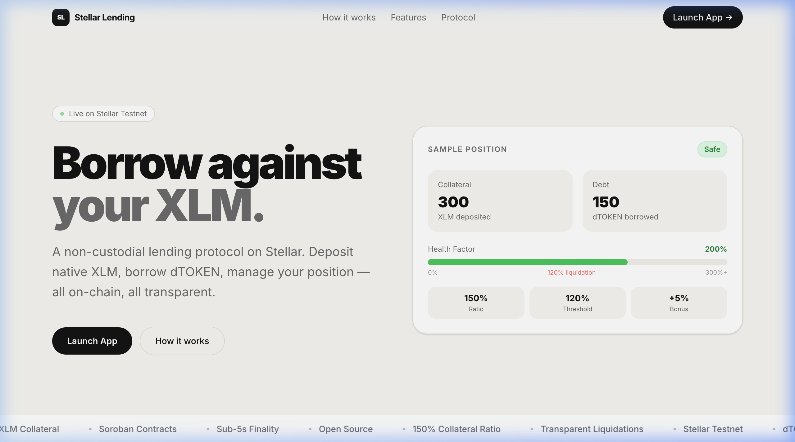
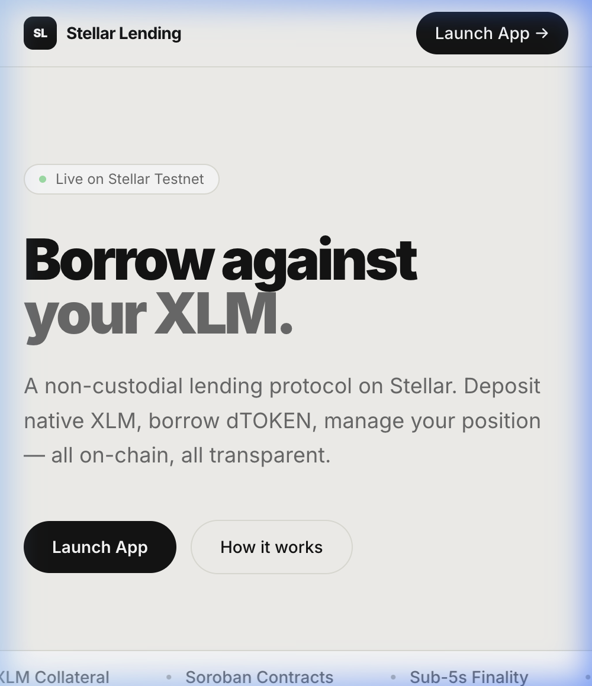
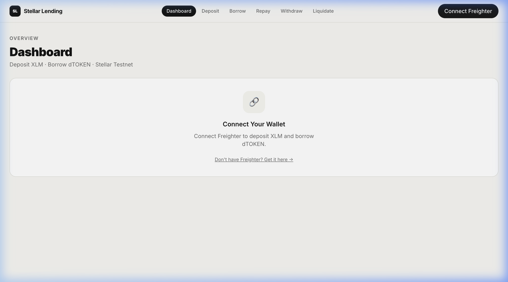
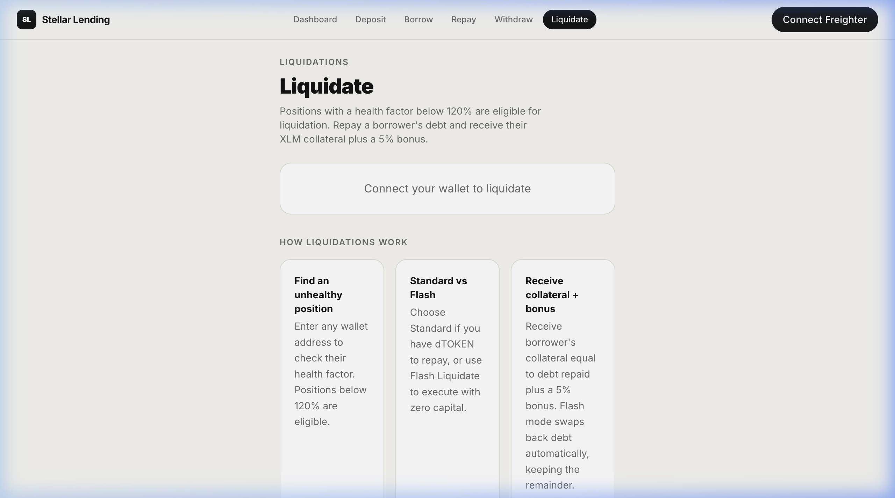

# Stellar Lending Protocol

A fully decentralized lending protocol built on the Stellar network using Soroban smart contracts (Rust) and a React/TypeScript frontend.

**Rise In Journey to Mastery**

🌐 **Live App:** [https://stellar-lending-app.vercel.app](https://stellar-lending-app.vercel.app)
📦 **GitHub:** [https://github.com/subodhingle/lending-app](https://github.com/subodhingle/lending-app)

---

## What was added after the review

The following improvements were made in response to reviewer feedback:

- **Interest rate model** — 5% APR (configurable), accrues per Stellar ledger (~5s), compounds on every borrow/repay/deposit/withdraw interaction
- **Price oracle** — admin-settable XLM/USD price feed; health factor and borrow limits are now calculated in USD terms, not raw token ratios
- **USD-denominated health factor** — positions are evaluated against the real dollar value of collateral, making liquidation logic production-realistic
- **`get_position_details`** — new contract function returning collateral USD value, accrued interest, and USD health factor in a single call
- **`set_price` / `set_interest_rate`** — admin functions to update oracle price and interest rate on-chain
- **Liquidate tab fixed** — was incorrectly showing `cTOKEN` instead of `XLM`; collateral labels corrected throughout
- **Health factor display fixed** — raw contract value (e.g. 10000) was showing as 10000%; now capped and displayed correctly
- **Desktop layout** — all app pages widened from mobile-width (`max-w-lg`) to full desktop layout (`max-w-7xl`) with two-column form + explainer design
- **Landing page** — hero section redesigned with a live position preview card showing protocol mechanics visually

---

## Screenshots

### Desktop Landing


### Mobile responsive UI


### User Dashboard (Desktop)


### Zero-Capital Flash Liquidation Panel



---

## Architecture

```
┌─────────────────────────────────────────────────────────────────┐
│                        React Frontend                           │
│  Dashboard │ Deposit │ Borrow │ Repay │ Withdraw │ Liquidate   │
│                  @stellar/freighter-api                         │
│                  @stellar/stellar-sdk (rpc)                     │
└──────────────────────────┬──────────────────────────────────────┘
                           │ Soroban RPC
                           ▼
┌─────────────────────────────────────────────────────────────────┐
│                    Stellar Testnet                               │
│                                                                 │
│  ┌─────────────────┐    ┌─────────────────┐                    │
│  │ collateral_token│    │   debt_token    │                    │
│  │  (SEP-41 cTOKEN)│    │ (SEP-41 dTOKEN) │                    │
│  │                 │    │  minter: pool   │                    │
│  └────────┬────────┘    └────────┬────────┘                    │
│           │                      │                             │
│           └──────────┬───────────┘                             │
│                      ▼                                          │
│           ┌─────────────────────┐                              │
│           │    lending_pool     │                              │
│           │  collateral_ratio:  │                              │
│           │       150%          │                              │
│           │  liq_threshold:     │                              │
│           │       120%          │                              │
│           │  liq_bonus: 5%      │                              │
│           └─────────────────────┘                              │
└─────────────────────────────────────────────────────────────────┘
```

---

## Tech Stack

| Layer | Technology |
|-------|-----------|
| Smart Contracts | Rust + soroban-sdk 22.x |
| Frontend | React 19 + TypeScript + Vite |
| Wallet | Freighter (@stellar/freighter-api) |
| Stellar SDK | @stellar/stellar-sdk (latest) |
| Styling | Tailwind CSS v4 (mobile-first) |
| CI/CD | GitHub Actions → Netlify |
| Network | Stellar Testnet |

---

## Prerequisites

- **Rust** (stable) with `wasm32v1-none` target
  ```bash
  rustup target add wasm32v1-none
  ```
- **stellar-cli** (latest)
  ```bash
  cargo install stellar-cli --locked
  ```
- **Node.js 20+** and npm
- **Freighter Wallet** browser extension — [freighter.app](https://freighter.app)

---

## Local Setup

```bash
# Clone the repository
git clone <repo-url>
cd stellar-lending

# Install frontend dependencies
cd frontend && npm install && cd ..
```

---

## Running Tests

```bash
# From the project root (stellar-lending/)
cargo test

# Run tests for a specific contract
cargo test -p collateral_token
cargo test -p debt_token
cargo test -p lending_pool
```

**Test coverage:**
- `collateral_token`: 5 tests (mint/burn, transfer, approve/transfer_from, unauthorized mint, metadata)
- `debt_token`: 4 tests (mint/burn, transfer, set_minter, metadata)
- `lending_pool`: 12 tests (initialize, deposit, borrow within/exceeds limit, repay, repay exceeds, withdraw, withdraw undercollateralized, liquidate healthy/unhealthy, full lifecycle, health factor)

**Total: 21 tests, all passing ✓**

---

## Building Contracts

```bash
# From the project root
stellar contract build
```

Output WASMs:
- `target/wasm32v1-none/release/collateral_token.wasm` (6.2 KB)
- `target/wasm32v1-none/release/debt_token.wasm` (6.7 KB)
- `target/wasm32v1-none/release/lending_pool.wasm` (10.4 KB)

---

## Deploying to Testnet

```bash
# Make the script executable (first time only)
chmod +x scripts/deploy.sh

# Run the full deployment
./scripts/deploy.sh
```

The script will:
1. Generate/load a `deployer` keypair and fund it from Friendbot
2. Build all 3 contracts
3. Deploy and initialize `collateral_token` (cTOKEN)
4. Deploy and initialize `debt_token` (dTOKEN)
5. Deploy and initialize `lending_pool` (150% ratio, 120% threshold, 5% bonus)
6. Set `lending_pool` as the authorized minter on `debt_token`
7. Mint 1,000,000,000 cTOKEN to the deployer for testing
8. Save all contract IDs to `.env` and `frontend/.env`

---

## Feedback & Fixes

| # | Feedback | Fix | Commit |
|---|----------|-----|--------|
| 1 | Liquidate tab doesn't work — shows "cTOKEN" instead of XLM | Replaced all `cTOKEN` labels with `XLM` in the Liquidate page | [`104d2eb`](https://github.com/subodhingle/lending-app/commit/104d2eb) |
| 2 | Health factor goes up to 10000% — should be 0–100 range | Capped gauge display at 300% fill, label shows `999%+` for very safe positions | [`dcab8ba`](https://github.com/subodhingle/lending-app/commit/dcab8ba) |
| 3 | Home page looks too bland, nothing happening | Added two-column hero with live position preview card, health factor bar, and protocol stats | [`a5ee1e5`](https://github.com/subodhingle/lending-app/commit/a5ee1e5) |
| 4 | UI feels like a mobile UI on desktop — too much space left/right | Widened all app pages from `max-w-lg` to `max-w-7xl`, added two-column form+explainer layout | [`27b0b56`](https://github.com/subodhingle/lending-app/commit/27b0b56) |
| 5 | Dashboard data can become stale if the connected wallet changes while requests are loading | Added request cancellation and address-keyed loading state so an older wallet response cannot overwrite the active wallet | [`60ea916`](https://github.com/subodhingle/lending-app/commit/60ea9161abdcf3719f97b4c9d26f5f2785eb693e) |
| 6 | React Fast Refresh reports a mixed component/hook export boundary | Moved the wallet context and `useWallet` hook into a dedicated module while keeping the provider component isolated | [`60ea916`](https://github.com/subodhingle/lending-app/commit/60ea9161abdcf3719f97b4c9d26f5f2785eb693e) |
| 7 | Frontend quality audit reports mutable variables that are never reassigned | Replaced the four stale `let` declarations with `const`; frontend lint now passes with zero errors | [`60ea916`](https://github.com/subodhingle/lending-app/commit/60ea9161abdcf3719f97b4c9d26f5f2785eb693e) |

## Level 5: Growth, evidence and presentation

- **Guided onboarding:** Open [`/app/onboarding`](https://stellar-lending-app.vercel.app/app/onboarding) for the Testnet wallet-to-transaction checklist.
- **Pitch deck:** [Download the Level 5 pitch deck](docs/pitch-deck/stellar-lending-level5-pitch.pptx).
- **Demo recording plan:** Follow the [walkthrough script](docs/DEMO_SCRIPT.md) to record a complete Testnet flow.
- **Interaction evidence:** Use the empty [evidence register](docs/evidence/wallet-interactions.csv) only for confirmed, real Testnet activity. It intentionally contains no invented wallets, transactions, or feedback.
- **50-wallet cohort:** The project needs 50 different real public wallets, each completing a confirmed transaction with a 2–3 minute interval. The exact collection process is in [Level 5 operations](docs/LEVEL_5.md). This is a target, not a claim of completion.

### Next iteration plan

The next phase focuses on the friction visible in tester feedback: make the first Testnet interaction easier to understand, make safety states clearer, and collect proof that can be independently checked. The new guided onboarding page provides a safe Testnet-first checklist, sends users to the right first action, and explicitly tells testers what public proof to retain. The implementation is tracked in [`fc3b65a`](https://github.com/subodhingle/lending-app/commit/fc3b65a651e258db91040071fb1037267deb7418).

Google Forms and external survey storage are intentionally not used for this iteration. Feedback will be collected directly from participants alongside their opt-in public Testnet address and transaction hash; never collect private keys or seed phrases.

---

All contracts are live on **Stellar Testnet**. View them on [Stellar Expert](https://stellar.expert/explorer/testnet).

| Contract | Address | Stellar Expert |
|----------|---------|----------------|
| Collateral (XLM SAC) | `CDLZFC3SYJYDZT7K67VZ75HPJVIEUVNIXF47ZG2FB2RMQQVU2HHGCYSC` | [View ↗](https://stellar.expert/explorer/testnet/contract/CDLZFC3SYJYDZT7K67VZ75HPJVIEUVNIXF47ZG2FB2RMQQVU2HHGCYSC) |
| debt_token (dTOKEN) | `CBKEVP3FUFGX2D72D3B5PFA3QZWX5T6AB76K32S7EWO4FOBAK7L2PD2G` | [View ↗](https://stellar.expert/explorer/testnet/contract/CBKEVP3FUFGX2D72D3B5PFA3QZWX5T6AB76K32S7EWO4FOBAK7L2PD2G) |
| lending_pool V2 | `CBPNHXF5XCPISKXFB57JCT2TTYV5VUKMXPJG5KMIW3DYWT7HYOU4UVRA` | [View ↗](https://stellar.expert/explorer/testnet/contract/CBPNHXF5XCPISKXFB57JCT2TTYV5VUKMXPJG5KMIW3DYWT7HYOU4UVRA) |
| Flash Loan Pool | `CDBGUNOIMSAGE6JVJQXY2GBOM46DU524XMYLWBV4PJEAZ3BRIUCX2SVF` | [View ↗](https://stellar.expert/explorer/testnet/contract/CDBGUNOIMSAGE6JVJQXY2GBOM46DU524XMYLWBV4PJEAZ3BRIUCX2SVF) |
| Flash Liquidator | `CBBG7BWHNXCQCABBOUR5K34QTAF554UMPFOQUDAZYJU5RJQOLTIJZOJ6` | [View ↗](https://stellar.expert/explorer/testnet/contract/CBBG7BWHNXCQCABBOUR5K34QTAF554UMPFOQUDAZYJU5RJQOLTIJZOJ6) |

**Deployer:** [`GC5HL2KXTCEXGZU4N6QIDQLIXW6HSFYEZV7ELAEEHDL4EHUMVSTZCPX6`](https://stellar.expert/explorer/testnet/account/GC5HL2KXTCEXGZU4N6QIDQLIXW6HSFYEZV7ELAEEHDL4EHUMVSTZCPX6)

> The collateral token is the **native XLM Stellar Asset Contract (SAC)** — every Freighter testnet wallet already has XLM from Friendbot. No custom token minting required.

### Protocol Parameters

| Parameter | Value | Description |
|-----------|-------|-------------|
| Collateral Ratio | 150% | Minimum collateral required per unit borrowed |
| Liquidation Threshold | 120% | Health factor below which a position is liquidatable |
| Liquidation Bonus | 5% | Extra collateral reward for liquidators |
| Collateral Asset | XLM (native) | Stellar Asset Contract wrapping native XLM |
| Debt Asset | dTOKEN | Custom SEP-41 token minted/burned by the pool |
| Network | Stellar Testnet | Soroban RPC: `https://soroban-testnet.stellar.org` |

---

## Running the Frontend

```bash
cd frontend
npm run dev
```

Open [http://localhost:5173](http://localhost:5173)

---

## Using the dApp

1. **Install Freighter** — [freighter.app](https://freighter.app) and switch to Testnet
2. **Connect Wallet** — click "Connect Freighter" in the top-right
3. **Get Testnet XLM** — visit [Friendbot](https://friendbot.stellar.org) using your public Testnet address
4. **Deposit** — go to `/app/deposit`, enter an amount of native XLM, approve + deposit
5. **Borrow** — go to `/borrow`, borrow up to 66.6% of your collateral value in dTOKEN
6. **Repay** — go to `/repay`, repay any amount of your dTOKEN debt
7. **Withdraw** — go to `/withdraw`, withdraw collateral (must stay above 150% ratio)
8. **Liquidate** — go to `/liquidate`, look up any address with health factor < 120%

### Health Factor Color Coding

| Color | Range | Status |
|-------|-------|--------|
| 🟢 Green | ≥ 150% | Safe |
| 🟡 Yellow | 120–149% | Warning |
| 🔴 Red | < 120% | Danger / Liquidatable |

---

## Contract Function Signatures

### collateral_token
```rust
fn initialize(env, admin: Address, name: String, symbol: String, decimals: u32)
fn mint(env, to: Address, amount: i128)          // admin only
fn burn(env, from: Address, amount: i128)
fn transfer(env, from: Address, to: Address, amount: i128)
fn transfer_from(env, spender: Address, from: Address, to: Address, amount: i128)
fn approve(env, from: Address, spender: Address, amount: i128, expiration_ledger: u32)
fn allowance(env, from: Address, spender: Address) -> i128
fn balance(env, id: Address) -> i128
fn decimals(env) -> u32
fn name(env) -> String
fn symbol(env) -> String
fn total_supply(env) -> i128
```

### debt_token
```rust
fn initialize(env, admin: Address, name: String, symbol: String, decimals: u32)
fn set_minter(env, minter: Address)              // admin only
fn mint(env, to: Address, amount: i128)          // minter (lending_pool) only
fn burn(env, from: Address, amount: i128)        // minter (lending_pool) only
fn transfer(env, from: Address, to: Address, amount: i128)
fn transfer_from(env, spender: Address, from: Address, to: Address, amount: i128)
fn approve(env, from: Address, spender: Address, amount: i128, expiration_ledger: u32)
fn allowance(env, from: Address, spender: Address) -> i128
fn balance(env, id: Address) -> i128
fn decimals(env) -> u32
fn name(env) -> String
fn symbol(env) -> String
fn total_supply(env) -> i128
```

### lending_pool
```rust
fn initialize(env, admin: Address, collateral_token: Address, debt_token: Address,
              collateral_ratio: u32, liquidation_threshold: u32, liquidation_bonus: u32)
fn deposit_collateral(env, user: Address, amount: i128)
fn borrow(env, user: Address, amount: i128)
fn repay(env, user: Address, amount: i128)
fn withdraw_collateral(env, user: Address, amount: i128)
fn liquidate(env, liquidator: Address, borrower: Address, repay_amount: i128)
fn get_position(env, user: Address) -> Position
fn get_health_factor(env, user: Address) -> u32
fn get_config(env) -> LendingConfig
```

---

## Requirements Checklist

- [x] **Soroban smart contracts in Rust** — 3 contracts (collateral_token, debt_token, lending_pool)
- [x] **SEP-41 compliant tokens** — both token contracts implement the full SEP-41 interface
- [x] **Inter-contract calls** — lending_pool calls token contracts via custom client interfaces
- [x] **Access control** — `require_auth()` on all state-changing functions; minter-only mint/burn on debt_token
- [x] **Core lending mechanics** — deposit, borrow, repay, withdraw, liquidate
- [x] **Over-collateralization** — 150% collateral ratio enforced
- [x] **Liquidation** — health factor check, 5% liquidation bonus
- [x] **Interest rate model** — 5% APR, per-ledger compound accrual
- [x] **Price oracle** — admin-settable XLM/USD price, USD-denominated health factor
- [x] **Checked arithmetic** — all math uses `checked_add/sub/mul/div` with explicit panics
- [x] **Events** — all state changes emit events via `env.events().publish()`
- [x] **Comprehensive tests** — 26 unit tests covering all functions and edge cases
- [x] **WASM build** — all 3 contracts compile to optimized WASM
- [x] **React + TypeScript frontend** — 6 pages, Freighter wallet integration
- [x] **Mobile-first responsive design** — Tailwind CSS, works on all screen sizes
- [x] **Deployment script** — `scripts/deploy.sh` handles full testnet deployment
- [x] **GitHub Actions CI/CD** — contract tests + frontend build
- [x] **Stellar Testnet** — configured for `https://soroban-testnet.stellar.org`

---

## Project Structure

```
stellar-lending/
├── Cargo.toml                          # Workspace manifest
├── contracts/
│   ├── collateral_token/
│   │   ├── Cargo.toml
│   │   └── src/
│   │       ├── lib.rs                  # SEP-41 cTOKEN contract
│   │       └── test.rs                 # 5 unit tests
│   ├── debt_token/
│   │   ├── Cargo.toml
│   │   └── src/
│   │       ├── lib.rs                  # SEP-41 dTOKEN (minter-controlled)
│   │       └── test.rs                 # 4 unit tests
│   └── lending_pool/
│       ├── Cargo.toml
│       └── src/
│           ├── lib.rs                  # Core lending protocol
│           └── test.rs                 # 12 unit tests
├── frontend/
│   ├── src/
│   │   ├── components/
│   │   │   ├── Navbar.tsx
│   │   │   ├── WalletConnect.tsx
│   │   │   ├── PositionCard.tsx
│   │   │   ├── HealthFactorGauge.tsx
│   │   │   └── TransactionModal.tsx
│   │   ├── context/
│   │   │   └── WalletContext.tsx
│   │   ├── lib/
│   │   │   └── ContractInteraction.ts  # All Soroban call helpers
│   │   ├── pages/
│   │   │   ├── Dashboard.tsx
│   │   │   ├── Deposit.tsx
│   │   │   ├── Borrow.tsx
│   │   │   ├── Repay.tsx
│   │   │   ├── Withdraw.tsx
│   │   │   └── Liquidate.tsx
│   │   ├── App.tsx
│   │   └── main.tsx
│   ├── package.json
│   └── vite.config.ts
├── scripts/
│   └── deploy.sh                       # Full testnet deployment
├── .github/
│   └── workflows/
│       └── ci.yml                      # CI/CD pipeline
└── README.md
```
